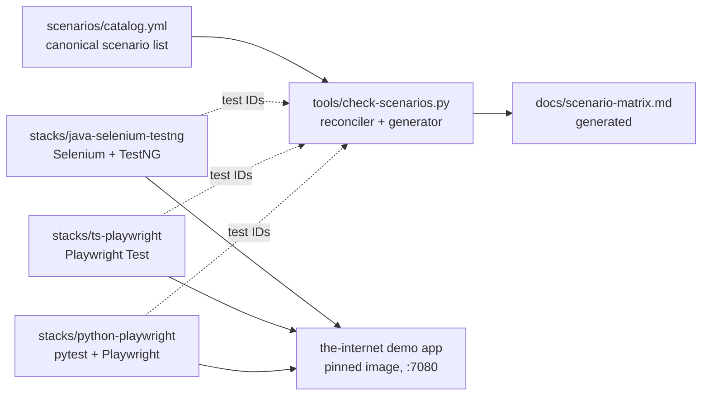

# Architecture

How the pieces fit: one catalog of scenarios, three independent stacks that
implement them, one pinned application they all test, and a checker that refuses
to let the first two disagree. This guide is for contributors and reviewers who
need the shape of the system before changing it. For what CI runs and when, read
[`ci-workflows.md`](ci-workflows.md); this guide does not restate it.

## The shape



In prose: the catalog is the only list of scenarios. The checker reads the
catalog, scrapes scenario IDs out of all three stacks' test sources, compares the
two in both directions, and regenerates the matrix. The three stacks never
reference each other; their only shared dependencies are the catalog they answer
to and the demo application they drive. Solid arrows are the generation and
execution paths; dotted arrows are the IDs the checker scrapes back out of each
stack.

## The scenario catalog is the canonical model

[`../scenarios/catalog.yml`](../scenarios/catalog.yml) is the single list of what
this repository tests: 48 scenarios today, 20 `P0`, 17 `P1`, 11 `P2`. Each row
carries an ID, a title, a priority, optional tags, and a `coverage:` map with one
boolean per stack:

```yaml
  - id: UI-LOGIN-001
    title: Login succeeds with valid credentials
    priority: P0
    tags: [smoke]
    coverage: {java-selenium-testng: true, ts-playwright: true, python-playwright: true}
```

Scenario IDs match `(?:UI|HTTP)-[A-Z0-9-]+`. The `UI-` and `HTTP-` prefixes are
the one deliberate split in the model: `UI-` scenarios drive a browser, `HTTP-`
scenarios check status codes, redirects, auth, and slow resources at the
resource layer, without asserting rendering. That split is why the `HTTP-`
scenarios are pinned to a single browser project in CI — running them per
browser would repeat identical assertions.

A scenario that is not in the catalog is not covered, however many tests exist.
The catalog leads; the tests follow.

## Three stack boundaries

Each stack is a self-contained project with its own toolchain, dependency
manifest, and README, and is runnable without the others. They deliberately
share no code — the repository's purpose is to compare them, so a shared
abstraction layer would destroy the thing being taught.

| Stack | Directory | Carries the scenario ID in | Test sources the checker reads |
| --- | --- | --- | --- |
| Java Selenium/TestNG | `stacks/java-selenium-testng` | The TestNG `testName="…"` attribute | `src/test/java/theinternetwebsite/ui/testcases/*.java` |
| TypeScript Playwright | `stacks/ts-playwright` | The test title | `tests/**/*.ts` |
| Python Playwright | `stacks/python-playwright` | The test docstring | `tests/**/*.py` |

Coverage is intentionally uneven: the TypeScript track is the flagship and
carries the most scenarios, Java carries the legacy-maintainer subset, and Python
carries the P0 suite plus selected P1 work. The matrix records that unevenness
rather than hiding it.

## The application under test

All three stacks drive the same target: the public
[The Internet](https://github.com/saucelabs/the-internet) demo app, run locally
and in CI from a container pinned by digest in
[`../docker/compose.yml`](../docker/compose.yml):

| Property | Value |
| --- | --- |
| Image | `gprestes/the-internet:v2.6.5`, pinned by `sha256:205b8fc7…` |
| Port mapping | `7080:5000` — container listens on 5000, host reaches it on 7080 |
| Base URL | `http://localhost:7080`, passed to each stack via `THE_INTERNET_BASE_URL` (Java uses `-DwebAppAddress`) |

The digest pin is what makes the suite honest. An unpinned demo app could change
under the tests and turn a real regression into a mystery, which is the exact
failure this repository teaches people to avoid. CI runs the identical image as a
service container, so a local failure and a CI failure mean the same thing.

## Test-ID reconciliation

[`../tools/check-scenarios.py`](../tools/check-scenarios.py) is the gate that
keeps the catalog and the tests from drifting apart. It parses the catalog,
extracts the ID set from each stack, and fails on any of these:

- A duplicate ID in the catalog.
- A catalog row marked covered for a stack that has no matching test.
- A test ID with no catalog row.
- A test ID whose catalog row is not marked covered for that stack.

Both directions matter: forgetting the test and forgetting the catalog row are
both errors. With `--write-matrix` the checker also regenerates
[`scenario-matrix.md`](scenario-matrix.md); CI regenerates and diffs it, so a
stale matrix fails the pull request.

### Matching is regex-based, and that is a real caveat

The checker greps; it does not parse. The two stacks are not equally strict:

| Stack | Pattern | Consequence |
| --- | --- | --- |
| Java | `testName\s*=\s*"(ID)"` | Anchored. The ID only counts inside a TestNG `testName` attribute. |
| TypeScript, Python | `\b(ID)\b` anywhere in the file | **Unanchored.** Any occurrence counts — including one inside a comment. |

So in the TypeScript and Python stacks, writing `// UI-SLIDER-001 is not done
yet` in a test file is enough to satisfy the checker that the scenario is
covered. The reconciliation is a spelling check on intent, not proof a test
exists or asserts anything. Python's IDs live in docstrings, which makes this
less theoretical than it sounds: the ID is already in a comment-like position by
design.

Treat green as "the catalog and the test sources agree about names", not "the
behavior is tested".

## Tag taxonomy

Tags are how a scenario says which slices may run it. TypeScript uses
`@`-prefixed title tags that Playwright filters with `--grep`; Python uses the
equivalent pytest markers, declared with `--strict-markers` so a typo fails
rather than silently matching nothing.

| Tag (TypeScript / Python) | Means | Why it exists |
| --- | --- | --- |
| `@http` / `http` | Resource-layer check, no rendering assertions | Runs once on the default browser instead of per browser |
| `@desktop` / `desktop` | Needs a mouse | Inverted out of mobile-emulation slices |
| `@mobile-emulation` / `mobile_emulation` | Needs a mobile device profile | Selects the `Mobile Chrome` and `Mobile Safari` projects |
| `@flaky-demo` / `flaky_demo` | Deliberately unstable teaching example | Kept out of every gate by default; see [`flakiness-guide.md`](flakiness-guide.md) |
| `@not-ci` / `not_ci` | Unsuitable for unattended runs | Local only, excluded everywhere in CI |
| `@smoke` / `smoke` | Fast subset | The always-on pull-request slice |

`@flaky-demo` and `@not-ci` are the load-bearing ones: this repository
deliberately contains unstable tests as teaching material, and the tags are what
stop that material from touching the gates.

No test currently carries `@mobile-emulation`, so the mobile-emulation slices
select nothing. That is why each Playwright slice is planned before it runs: the
plan step counts matching tests and skips the slice at zero rather than failing
it. An empty slice is a valid state here, not a bug.

## Artifact flow

Every stack stages its reports under `artifacts/<stack>/<run-id>/<slice>/` before
uploading, so outputs are grouped by stack, run, and slice rather than colliding
in one directory:

- `<stack>` is `java`, `ts`, or `py`.
- `<run-id>` is the GitHub run ID, which keeps reruns distinct.
- `<slice>` is the matrix leg, such as `smoke` or a browser project.

`artifacts/` is git-ignored: it is a staging area for upload, never a committed
result. Uploads run under `if: always()`, so a failing test still produces its
trace — which is the only reason the artifacts are worth having. These artifacts
are public on a public repository; see the secrets and captures rules in
[`../CONTRIBUTING.md`](../CONTRIBUTING.md) for what must never end up in one.

## CI fan-out

Triggers fan out to independent workflows with no chaining: an always-on fast
gate on every change, three path-filtered per-stack regressions, and a nightly
cross-browser and Grid sweep. Nothing uses `needs:`, `workflow_run:`,
`workflow_call:`, or `concurrency:`, so no workflow orders or cancels another.

That is the whole architectural claim. For the trigger map, the job and step
lists, the matrices, and where each job stages its reports, read
[`ci-workflows.md`](ci-workflows.md), which mirrors
[`../.github/workflows/`](../.github/workflows/) and is the only place those
tables live.

## Canonical sources

When two descriptions of this system disagree, resolve in the order recorded in
the [documentation index](README.md): the workflows, then the catalog, then the
generated matrix, then the stack READMEs, then the guides — with the root README
deferring to all of them. Every document in that order is executable except the
last two, which is the point: prose loses to the thing that runs.
