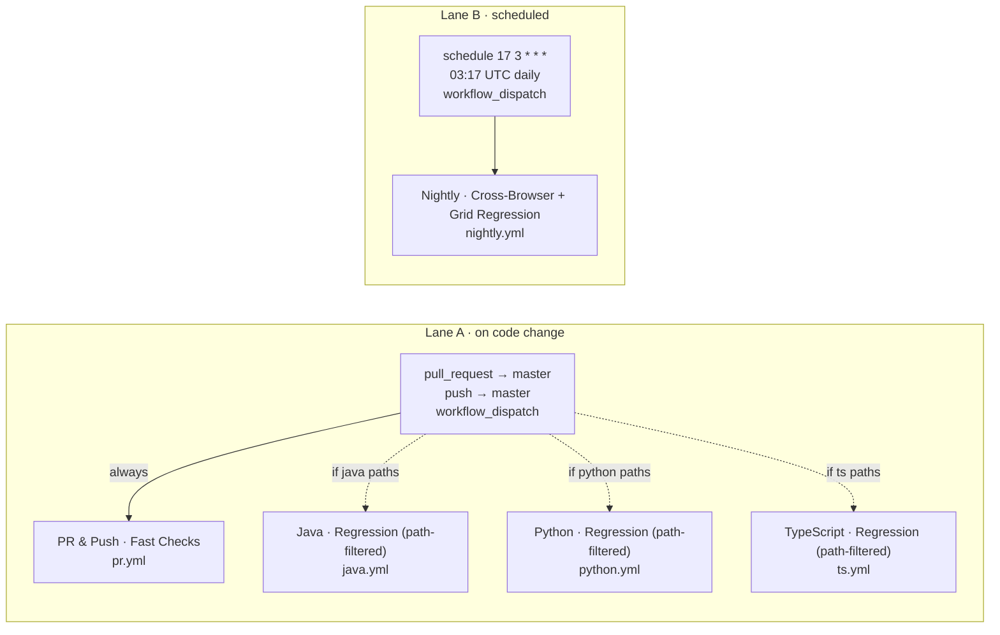

# CI workflows

Use this guide to understand what runs in CI, when, and why: the trigger fan-out, the per-stack regressions, and the nightly sweep. It is for contributors and reviewers who need to predict which checks a change will start, read the Actions tab without guessing, and find where each job stages its reports. The source of truth is [`.github/workflows/`](../.github/workflows/); this guide mirrors it.

## The one rule that shapes everything

There is no `needs:`, `workflow_run:`, `workflow_call:`, or `concurrency:` anywhere in the five workflows, so nothing chains, orders, or cancels anything else. Every trigger fans out to its matching workflows in parallel, and inside each workflow every job runs in parallel with the others. The only sequential execution is the ordered list of steps inside a single job. Read the step lists below top to bottom for order within a job, and treat everything else as concurrent.

## Trigger fan-out

Solid arrows mark always-on or scheduled triggers; dotted arrows mark triggers that are conditional on a path filter.

## Two lanes

### Lane A · on code change

- **PR & Push · Fast Checks (lint + smoke)** (`pr.yml`) runs on every pull request and every push to `master`, with no path filter, so it gates all changes. Its five jobs cover repository hygiene, scenario-catalog drift, and a compile-plus-smoke slice for each stack.
- The three per-stack regression workflows run only when their path filters match. Each filters on its own stack directory, plus `scenarios/**`, `tools/**`, and its own workflow file:
  - **Java · Regression (path-filtered)** (`java.yml`) on `stacks/java-selenium-testng/**`.
  - **Python · Regression (path-filtered)** (`python.yml`) on `stacks/python-playwright/**`.
  - **TypeScript · Regression (path-filtered)** (`ts.yml`) on `stacks/ts-playwright/**`.
- Teaching detail: because all three regression workflows also list `scenarios/**` and `tools/**`, a change under either shared path triggers all three stack workflows at once, while a change confined to one stack directory triggers only that stack.

### Lane B · scheduled

- **Nightly · Cross-Browser + Grid Regression** (`nightly.yml`) runs on cron `17 3 * * *` (03:17 UTC daily) or on manual `workflow_dispatch`. The dispatch exposes an `include-flaky-demo` boolean input; when it is true, the nightly slices also include the `@flaky-demo` / `flaky_demo` tests that are otherwise excluded.

## Workflows

| Workflow | Trigger | Intent | Jobs | File |
| --- | --- | --- | --- | --- |
| PR & Push · Fast Checks (lint + smoke) | `pull_request` and `push` to `master`; `workflow_dispatch` | Fast lint and smoke gate on every change | `repo-hygiene`, `scenario-catalog`, `java-smoke`, `ts-smoke`, `py-smoke` | [`pr.yml`](../.github/workflows/pr.yml) |
| Java · Regression (path-filtered) | `pull_request` and `push` to `master`, path-filtered; `workflow_dispatch` | Java regression across local browsers | `java-regression` | [`java.yml`](../.github/workflows/java.yml) |
| Python · Regression (path-filtered) | `pull_request` and `push` to `master`, path-filtered; `workflow_dispatch` | Python regression across browser and mobile projects | `python-regression` | [`python.yml`](../.github/workflows/python.yml) |
| TypeScript · Regression (path-filtered) | `pull_request` and `push` to `master`, path-filtered; `workflow_dispatch` | TypeScript regression across browser and mobile projects | `typescript-regression` | [`ts.yml`](../.github/workflows/ts.yml) |
| Nightly · Cross-Browser + Grid Regression | `schedule` `17 3 * * *`; `workflow_dispatch` | Broad nightly sweep including a Selenium Grid pass | `java-nightly-local`, `java-nightly-grid`, `typescript-nightly`, `python-nightly` | [`nightly.yml`](../.github/workflows/nightly.yml) |

## Jobs and steps

Steps run top to bottom within each job. A step marked (always) carries `if: always()`; a step marked (conditional) carries another `if:` guard.

| Job (`id`) | Intent | Steps (top to bottom) | File |
| --- | --- | --- | --- |
| `repo-hygiene` | Lint workflows, commit messages, and Markdown, check documentation links, and require CI-guide updates alongside workflow changes | 1. Checkout repository, 2. Set up Node 22, 3. Lint GitHub Actions workflows, 4. Lint pull request commits (conditional), 5. Lint latest commit (conditional), 6. Lint Markdown, 7. Check Markdown links, 8. Require CI guide updates with workflow changes (conditional) | [`pr.yml`](../.github/workflows/pr.yml) |
| `scenario-catalog` | Fail if the generated scenario matrix or the README embed of it has drifted | 1. Checkout repository, 2. Check scenario catalog | [`pr.yml`](../.github/workflows/pr.yml) |
| `java-smoke` | Compile the Java tests and run the Chrome smoke suite | 1. Checkout repository, 2. Set up JDK 25, 3. Compile Java tests, 4. Run Java smoke, 5. Stage Java reports (always), 6. Upload Surefire XML (always) | [`pr.yml`](../.github/workflows/pr.yml) |
| `ts-smoke` | Type-check, lint, and format-check, then run the Chromium smoke suite | 1. Checkout repository, 2. Set up Node 22, 3. Install TypeScript stack dependencies, 4. Type-check TypeScript stack, 5. Lint TypeScript stack, 6. Check TypeScript stack formatting, 7. Install Chromium browser, 8. Run TypeScript Chromium smoke, 9. Upload Playwright artifacts (always) | [`pr.yml`](../.github/workflows/pr.yml) |
| `py-smoke` | Lint, format-check, and type-check, then run the Chromium smoke suite | 1. Checkout repository, 2. Set up Python 3.14, 3. Install Python stack dependencies, 4. Lint Python stack, 5. Check Python stack formatting, 6. Type-check Python stack, 7. Install Chromium browser, 8. Run Python Chromium smoke, 9. Upload Playwright artifacts (always) | [`pr.yml`](../.github/workflows/pr.yml) |
| `java-regression` | Run the Java regression suite per matrix browser | 1. Checkout repository, 2. Set up JDK 25, 3. Run Java regression, 4. Stage Java reports (always), 5. Upload Surefire XML (always) | [`java.yml`](../.github/workflows/java.yml) |
| `python-regression` | Plan and run each Python Playwright slice per matrix project | 1. Checkout repository, 2. Set up Python 3.14, 3. Install Python stack dependencies, 4. Plan Python Playwright slice, 5. Install Playwright browser (conditional), 6. Run Python Playwright slice (conditional), 7. Upload Playwright artifacts (always) | [`python.yml`](../.github/workflows/python.yml) |
| `typescript-regression` | Plan and run each TypeScript Playwright slice per matrix project | 1. Checkout repository, 2. Set up Node 22, 3. Install TypeScript stack dependencies, 4. Plan TypeScript Playwright slice, 5. Install Playwright browsers (conditional), 6. Run TypeScript Playwright slice (conditional), 7. Upload Playwright artifacts (always) | [`ts.yml`](../.github/workflows/ts.yml) |
| `java-nightly-local` | Run the Java regression suite with a local driver per matrix browser | 1. Checkout repository, 2. Set up JDK 25, 3. Run Java nightly regression, 4. Stage Java reports (always), 5. Upload Surefire XML (always) | [`nightly.yml`](../.github/workflows/nightly.yml) |
| `java-nightly-grid` | Run the Java regression suite against Selenium Grid per matrix browser | 1. Checkout repository, 2. Set up JDK 25, 3. Wait for Selenium Grid, 4. Run Java Selenium Grid nightly regression, 5. Stage Java Grid reports (always), 6. Upload Java Grid Surefire XML (always) | [`nightly.yml`](../.github/workflows/nightly.yml) |
| `typescript-nightly` | Plan and run each TypeScript nightly slice per matrix project | 1. Checkout repository, 2. Set up Node 22, 3. Install TypeScript stack dependencies, 4. Plan TypeScript nightly slice, 5. Install Playwright browser (conditional), 6. Run TypeScript nightly slice (conditional), 7. Upload Playwright artifacts (always) | [`nightly.yml`](../.github/workflows/nightly.yml) |
| `python-nightly` | Plan and run each Python nightly slice per matrix project | 1. Checkout repository, 2. Set up Python 3.14, 3. Install Python stack dependencies, 4. Plan Python nightly slice, 5. Install Playwright browser (conditional), 6. Run Python nightly slice (conditional), 7. Upload Playwright artifacts (always) | [`nightly.yml`](../.github/workflows/nightly.yml) |

This guide is the one document CI checks against its own source. A pull request
that changes anything under `.github/workflows/` without touching this file fails
`repo-hygiene`, because a step-level mirror that nothing enforces is the highest-
risk documentation in the repository: it stays plausible long after it stops
being true. If a workflow change genuinely has no semantic effect here — a
whitespace or comment edit — put the literal token `[ci-guide-exempt]` in the
pull request title to skip the check.

## Matrix and tags

Each regression and nightly job fans out over a `strategy.matrix`, with `fail-fast` disabled so one failing leg never cancels the rest.

| Stack | Regression projects | Nightly projects |
| --- | --- | --- |
| Java | `chrome`, `firefox` | Local driver `chrome`, `edge`, `firefox`; Selenium Grid `chrome`, `edge`, `firefox` |
| TypeScript | `chromium`, `firefox`, `webkit`, `Mobile Chrome`, `Mobile Safari` | The five regression projects plus branded `chrome` and `msedge` |
| Python | `chromium`, `firefox`, `webkit`, `Mobile Chrome`, `Mobile Safari` | The five regression projects plus branded `chrome` and `msedge` |

TypeScript and Python select tests by tag. Playwright (TypeScript) filters `@`-prefixed title tags with `--grep` and `--grep-invert`; pytest (Python) filters equivalent markers with `-m` expressions. The two stacks mirror the same taxonomy:

- `@http` / `http` — resource-layer checks that hit HTTP endpoints; pinned to the default browser project and inverted out of the others so they run once, not per browser.
- `@desktop` / `desktop` — mouse-only behavior; inverted out of the mobile-emulation projects.
- `@mobile-emulation` / `mobile_emulation` — tests that require a mobile device profile; the `Mobile Chrome` and `Mobile Safari` projects grep for them and invert `@desktop`.
- `@flaky-demo` / `flaky_demo` — deliberately unstable teaching examples; excluded from the PR and nightly gates by default, and added to nightly only when the `include-flaky-demo` dispatch input is true.
- `@not-ci` / `not_ci` — examples unsuitable for scheduled automation; excluded everywhere in CI and run only locally.

See [`docs/flakiness-guide.md`](flakiness-guide.md) for how these tags keep unstable patterns out of the gates.

Each Playwright slice is planned before it runs. A **Plan ... slice** step collects the matching tests (`--list` for Playwright, `--collect-only` for pytest) and writes a `count`; the install and run steps carry `if: steps.slice.outputs.count != '0'`, so a slice with no matching tests is skipped instead of failing. The Java jobs have no plan step and run their TestNG suite directly.

## Artifacts

Every stack stages its reports under `artifacts/<stack>/<run-id>/<slice>/` before uploading, so a run's outputs are grouped by stack and slice:

- **Java** (`artifacts/java/...`) — Surefire XML, staged by a **Stage ... reports** step and uploaded by an **Upload Surefire XML** step, both `if: always()`.
- **TypeScript** (`artifacts/ts/...`) — the Playwright HTML report plus retained traces, screenshots, and videos, uploaded by **Upload Playwright artifacts** `if: always()`.
- **Python** (`artifacts/py/...`) — JUnit XML plus retained traces, screenshots, and videos, uploaded by **Upload Playwright artifacts** `if: always()`.

Because the uploads run on `always()`, artifacts are available even when the test step fails. See the [`README.md`](../README.md) reports section for the matching per-stack local report paths.
